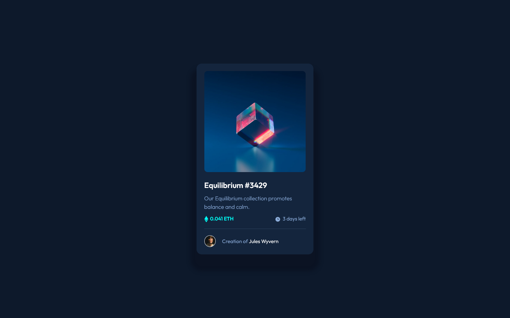

# Frontend Mentor - NFT preview card component solution

This is a solution to the [NFT preview card component challenge on Frontend Mentor](https://www.frontendmentor.io/challenges/nft-preview-card-component-SbdUL_w0U). Frontend Mentor challenges help you improve your coding skills by building realistic projects.

## Table of contents

- [Overview](#overview)
  - [The challenge](#the-challenge)
  - [The challenger](#the-challenger)
  - [Screenshot](#screenshot)
  - [Links](#links)
- [My process](#my-process)

  - [Planning](#planning)
  - [Built with](#built-with)
  - [What I learned](#what-i-learned)
  - [Continued development](#continued-development)
  - [Useful resources](#useful-resources)

- [Author](#author)

## Overview

### The challenge

Users should be able to:

- View the optimal layout depending on their device's screen size
- See hover states for interactive elements

### The challenger

Hi everyone! First and foremost i want you to know that english isn't my first language and, even if i do try to make myself clear and explain my process as well as possible, there's still a high chance i'll do mispellings or grammatical errors. If that happen, please forgive me.

This is my fourth project from Frontend Mentor. You should know i'm an aspiring front-end developper which means i'm not a very good source to learn web development. Yet, i do my best to tackle each project seriously and explain my thought process so that maybe one day it could be of some help to someone. It's also important to me because i want to be able to come back to these README files to see my progress / search references / reflect on the way i worked / etc

Sorry for the long introduction. Without further delay, let's dig in!

### Screenshot

### Links

- Solution URL: [Project on GitHub](https://github.com/joanFaseDev/nft-preview-card)
- Live Site URL: [Projet hosted through Vercel](https://nft-preview-card-beta-jet.vercel.app/)

## My process

### Planning

This challenge is about reproducing a card promoting some kind of NFT. There's two designs to display (mobile and desktop one) but, upon closer inspection, it appears that the two designs are almost identicals (some tiny changes in padding/margin but nothing more i could see). It's important because that means the page is almost non responsive and so there's no real need to use media queries and relative length units. Yet these units (rems, ems, percentages and the like) are the ones mostly used today (because they help building this responsive side every web page should have) and i don't want to lose an opportunity to handle them in a project so i'll go with it.

My plan is to use CSS Grid here. It's probably too much considering the simple design of the card but i really want to get better at using the grid and this kind of project seems perfect to get the hand of it. One grid made of one column and three rows. I'll change the second row in a flexbox container to align the various items inside.

Not much more to say about the content; as for the card it seems to have a very large shadow. Not sure if we're supposed to reproduce that but i'll play a bit with the _shadow-box_ property and see what i can do.

### Built with

- HTML
- CSS
- Flexbox
- CSS Grid

### What I learned

I don't feel like i learned much technical stuff on this project. It's a static page which greatly simplify the work to do. Not having to deal with 'responsiveness' means there's a lot less chances for something to go wrong. That being said, i do think i started to understand some things about designing a layout. More precisely, what i should start to lay first. Until now, every project was working on mobile design first then, once finished, using media queries and the like to somehow ending up creating the desktop design. I think a better way to go about it is to 'lay the two designs simultaneously'. What i mean by that is creating the big shapes first, without all theirs contents, and see how it's possible to transition from mobile to desktop smoothly. Proceding that way means working with less elements in the early stages and laying the global design from the get-go. It seems to me like an iterative way, more abstract and enjoyable than what i did before. I'll test it on the next project.

### Continued development

For now, i want to keep experimenting  with relative lengh units and css grid. I think there's too much i don't understand about these tools and i also think knowing how to use them correctly is mandatory for a front-end developper.

I also want to learn how to use css variables because it seems like something easy to understand which can possibly saves a lot of time.

### Useful resources

- [MDN Article focused on the aria role 'article'](https://developer.mozilla.org/en-US/docs/Web/Accessibility/ARIA/Roles/article_role) - This helped me to further inquire about accessibility in web developpement and the various ways developpers can tweak their codes to improves the experience of people using assisting technologies.
- [Fundamental concepts of Aria, its purpose and how to use it](https://w3c.github.io/aria-practices/) - W3C's draft about accessibility and Aria's concepts. I only read part of it but i'll put the link here because i feel most of my questions about accessibility have theirs answers inside.

## Author

- Frontend Mentor - [@joanFaseDev](https://www.frontendmentor.io/profile/joanFaseDev)

- Website - [GitPage hosting all my projects from Frontend Mentor](https://joanfasedev.github.io/FrontEnd-mentor-projects/)

  
